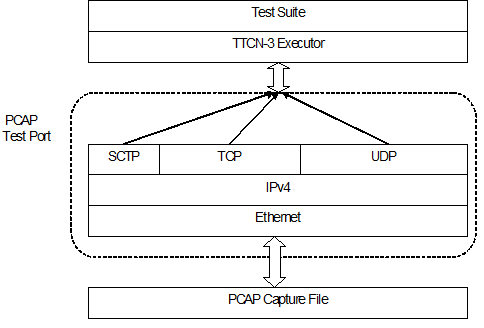
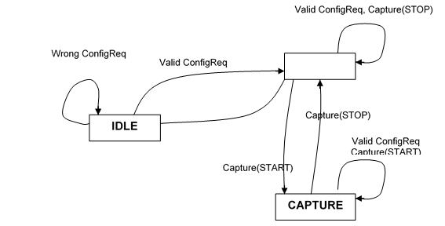

= PCAP Test Port for TTCN-3 Toolset with TITAN, Description
:author: Gábor Szalai
:revnumber: 1551-CNL 113 443, Rev. A
:revdate: 2014-09-24
:toc:

= Functionality

The PCAP test port has basically two operating modes. In reading mode, it is able to process recorded network traffic, saved in a file in libpcap format, and recover the protocol messages. These messages are then delivered to TTCN-3 as octetstring.

The currently used protocol stack in reading mode can be seen in the figure below:

In capturing mode the test port can be used to capture Ethernet packets to a file, controlled from the TTCN-3 environment. Filtering of messages can be set both at capturing and reading modes.

== System Requirements

In order to use the PCAP test port the following system requirements must be satisfied:

* The libpcap <<_4, [4]>> library must be installed.
* TITAN TTCN-3 Test Executor version R7A (1.7.pl0) or higher installed. For installation guide see <<_2, [2]>>.

NOTE: This version of the test port is not compatible with TITAN releases earlier than R7A.

= Feature List

== Capturing Mode

In capturing mode the test port starts to listen on a network interface, filters the traffic and saves the incoming Ethernet packets to a capture file.

=== State Machine for Capturing Mode

The Capturing mode can be described in the following state machine, where state transitions are ASP requests and responses:

== Reading Mode

In reading mode the test port opens a capture file and processes the saved packets. The recorded traffic can be filtered with user-provided filter expressions. The test port assembles the TCP, SCTP and UDP streams and separates the upper layer protocol messages using the user provided functions.

= Supported Protocols

== Ethernet

The test port expects Ethernet II datagrams and in the Ethernet header it must be indicated, that the carried payload is either an IP datagram or a VLAN frame, else the packet is dropped by the test port and a warning message is generated: `*"Not an IP datagram"*`.

== VLAN

The test port is able to detect whether the Ethernet frame carries a VLAN frame and it can skip this header to advance to the IPv4 datagram.

== Internet Protocol

The test port supports only IPv4. IPv6 datagrams are dropped by the test port and the following warning message is generated: `*"Unknown IP version: 6"*`.

== IPSec

The test port is able to handle IPSec encapsulation. The test port uses user provided function for decrypting and integrity checking. The NULL encryption is supported only by default.

NOTE: The IPSec support is experimental.

== Transmission Control Protocol

The test port is able to assemble TCP streams considering TCP segmentation and retransmission.

If TCP segments are missing from the capture file – which is a common phenomenon – the TP is able to detect the missing segments based on the acknowledgement number of the TCP segments. In this case the test port jumps over the missing gap in the stream and assembles the remaining part of the stream. Please note, that with a small probability it is possible that the decoder wrongly synchronizes to the stream after a gap. In this case the decoding of the rest of the stream will not be successful.

Whenever a lost TCP segment is detected the test port indicates a warning message to the user and an ASP called `ASP_PCAP_Error` is sent as well.

== User Datagram Protocol

The test port can handle UDP datagrams. Duplicates are not checked.

== Stream Control Transmission Protocol

The test port is able to assemble SCTP streams considering SCTP segmentation and retransmission.

== Upper Layer Protocols

The PCAP test port can separate the upper layer protocol messages in the reassembled streams. The separation is based on the user provided functions. If the upper layer protocol use UDP or SCTP as transport layer no message separation functions are needed, because the SCTP preserves the message boundaries and usually one UDP packet carries one protocol message.

=== User Provided Functions

The following functions can be provided by the user:

==== Message Length Calculator Function

That function calculates the length of the first message in the buffer.

Signature of the function:

[source]
----
type function tf_getMsgLen(in octetstring stream, in boolean conn_closed,
in Transport stream_transport) return integer;
----

Parameters:

* `stream` - contains the reassembled stream

* `conn_closed` - true if the connection already closed

* `stream_transport` - 1:TCP, 2:UDP, 3:SCTP

Return values:

* `_-1_` - The length of the message can not be determined.

* `_>0_` - The length of the message in the buffer

==== Message Start Position Function

That function locates the position of the first octet of the protocol message in the buffer.

Signature of the function:

[source]
----
type function tf_getMsgStartPos (in octetstring stream, in boolean conn_closed,
in Transport stream_transport) return integer;
----

Parameters:

* `stream` - contains the reassembled stream

* `conn_closed` - true if the connection already closed

* `stream_transport` - 1:TCP, 2:UDP, 3:SCTP

Return values:

* `_-1_`: The position of the message can not be determined.

* `_>=0_`: The position of the message in the buffer

= Test Port Operations

== Description of Files in This Product

The PCAP test port includes the following files:

* __PCAPasp_Types.ttcn__ - Contains the TTCN-3 structure of the PCAP ASPs, the definitions of message types, attributes, parameters and types.
* __PCAPasp_PortType.ttcn__ - This TTCN-3 module contains the definition of the PCAP port type.
* __PCAPasp_PT.hh__ - C++ header file of the PCAP test port.
* __PCAPasp_PT.cc__ - C++ source file containing the implementation of the PCAP test port.

== Installation

Since the PCAP test port is used as a part of a TTCN-3 test suite, it requires TTCN-3 Test Executor be installed before the module can be compiled and executed together with other parts of the test suite. For more details on the installation of TTCN-3 Test Executor see the relevant section of <<_2, [2]>>

When building the executable test suite, the libraries compiled for the TTCN-3 Test Executor, the libpcap library should also be linked into the executable.

== Configuration

The executable test program behavior is determined via the run-time configuration file. This is a simple text file, which contains various sections (e.g. `[TESTPORT_PARAMETERS]`) after each other. The conventional suffix of configuration files is _.cfg_. For further information on the configuration file see <<_2, [2]>>.

The following sections describe the PCAP test port-related parameters `[TESTPORT_PARAMETERS]`. Parameter names are case-sensitive; while parameter values are not case-sensitive (i.e. `_"YES"_`, `_"yes"_` and `_"Yes"_` values are identical).

=== PCAP Test Port Parameters

* `capture_file`
+
Here the path to the capture file should be given, that will be processed by the test port in reading mode. This parameter is optional, but if not present, the test port can be used only in capturing mode.

* `packet_filter`
+
The user can specify here a libpcap filter expression. The capture file will be filtered in reading mode according to the expression. Therefore this parameter is optional and used only in reading mode. The format of the expression is exactly the same as the filter expression used by tcpdump <<_4, [4]>>.

* `logging`
+
The user can switch on/off logging by setting the value of this parameter to `_TRUE_` or `_FALSE_`.
+
The default value for logging is set to `_FALSE_`.

* `noFilter`
+
When this parameter is set to `_TRUE_`, then the test port returns all the captured frames from the capture file not only those that are matched with the configure DumpFilters. The returned protocol id of the frames will be `_1_`.
+
The default value for `noFilter` is set to `_FALSE_`, when the frames will be only returned in case the frame matches a `DumpFilter` setting.

== Reading Mode

[[asp-pcap-dumpreaderfilter]]
=== `ASP_PCAP_DumpReaderFilter`

Direction: TTCN-3 TP

This ASP configures the test port to decode one or more streams. The fields specify a set of streams and the expected protocol type:

* `messageType` - specifies the protocol, integer value, greater than zero.
* `remoteIp` - remote IP address
* `localIp` - local IP address. "*" wildcard also accepted, which turns off the localIp address matching.
* `remotePorts` - a list of remote port numbers

[[asp-pcap-dumpfilterresp]]
=== `ASP_PCAP_DumpFilterResp`

Direction: TP TTCN-3

This ASP acknowledges the `ASP_PCAP_DumpReaderFilter` ASP.

* `status`: VALID if the previous filter request was accepted, or INVALID, if not
* `errorMessage`: if status is INVALID, this field contains the reason for rejecting the `ASP_PCAP_DumpReaderFilter` request.

`*WRONG_SOURCE_IP*`

The test port couldn’t process the local IP address given in the previous `ASP_PCAP_DumpReaderFilter`.

`*WRONG_DESTINATION_IP*`

The test port couldn’t process the remote IP address given in the previous `ASP_PCAP_DumpReaderFilter`.

[[asp-pacp-setupprotocol]]
=== `ASP_PACP_SetupProtocol`

Direction: TTCN-3 TP

Setup the message separation functions for a given protocol.

* `messageType` - specifies the protocol, integer value, greater than zero. Same as used in the `ASP_PCAP_DumpReaderFilter`
* `getMsgLen_function` - The message length calculation function reference.
* `getMsgStartPos_function` - The message start position locator function reference.

[[asp-pcap-connectionclosed]]
=== `ASP_PCAP_ConnectionClosed`

Direction: TP TTCN-3

This ASP is sent by the test port, when a registered stream is closed with a TCP FIN segment. The fields are appointing the given TCP stream:

* `protocol` - holds the protocol type
* `destinationIP` - destination address of the TCP stream in decimal dot notation
* `destinationPort` - destination port number of the TCP stream
* `sourceIP` - source address of the TCP stream in decimal dot notation
* `sourcePort` - source port number of the TCP stream

[[asp-pcap-error]]
=== `ASP_PCAP_Error`

Direction: TP TTCN-3

This ASP is sent to the TTCN-3 user, whenever unexpected events occur during the processing of a capture file. The first field contains an error message the rest appoints the observed stream, where the error appeared.

* `errorType` - holds an enumerated field, that describes the event. Currently only one event can occur: `LOST_SEGMENT` which means the capture file does not contain an expected segment.
* `destinationIP` - destination address of the TCP stream in decimal dot notation
* `destinationPort` - destination port number of the TCP stream
* `sourceIP` - source address of the TCP stream in decimal dot notation
* `sourcePort` - source port number of the TCP stream

Existing error messages for the `errorType` field:

`*LOST_SEGMENT*`

If TCP segments are missing from the capture file – which is a common phenomenon – the TP is able to detect the missing segments based on the acknowledgement number of the TCP segments. In this case the test port jumps over the missing gap in the stream and assembles the remaining part of the stream.

NOTE: This remaining part must begin with a valid message or else the test port will not be able to decode the stream, because it has no knowledge about the location of the next valid message.

[[asp-pcap-messagereq]]
=== `ASP_PCAP_MessageReq`

Direction: TTCN-3 TP

With this ASP the user requests the next protocol message. It has only one field that specifies the protocol type of the desired message:

* `nextMessage`: The protocol id of the requested message or `_-1_`. It is the same value as used in `ASP_PCAP_DumpReaderFilter`. The `_-1_` means any messages.

It is important to mention, that the test port processes the capture file sequentially and it does not buffer messages. This means that, if for instance a Radius message is requested, then the detected Diameter, LDAP and SIP messages are immediately dropped until a valid Radius message is found.

[[asp-pcap-messageresp]]
=== `ASP_PCAP_MessageResp`

Direction: TP TTCN-3

This ASP is the response to an `ASP_PCAP_MessageReq`

* `status` - it is `VALID_MESSAGE` if the ASP contains a complete message that conforms to the requested protocol type. If the test port hasn’t found a valid message this status is set to `NO_MESSAGE`. This also indicates that the dump file was fully processed.
* `timeStamp` - the time stamp of the message. If the message was segmented, then this time stamp is equal to the time stamp of the last segment that was necessary to assemble the whole message.
* `contentLength` - the length of the encoded message in bytes
* `destinationIP` - destination address of the message in decimal dot notation
* `destinationPort` - destination port number of the message
* `sourceIP` - source address of the message in decimal dot notation
* `sourcePort` - source port number of the message
* `msgtype` - the protocol id of the message
* `nextMessage` - the found message if the status is `VALID_MESSAGE`. In case of `NO_MESSAGE` this field is omitted.

== Capturing Mode

In capturing mode the test port starts to listen on a network interface, filters the traffic and saves the incoming Ethernet packets to a capture file. The following ASPs are used:

[[asp-pcap-configreq]]
=== `ASP_PCAP_ConfigReq`

Direction: TTCN-3 TP

This ASP initializes the capturing device. At least the `filename` field must be given, where the captured packets will be saved. The other parameters are optional and have default values:

* `Interface: eth0`
* `Mask: 0xFFFFFFFF`
* `Filter: empty filter`

[[asp-pcap-capture]]
=== `ASP_PCAP_Capture`

Direction: TTCN-3 TP

Using this ASP the capture can be started and stopped.

[[asp-pcap-configresp]]
=== `ASP_PCAP_ConfigResp`

Direction: TP TTCN-3

This ASP is the acknowledgement for the previous two ASPs. It carries the following fields:

* `Command`: specifies the acknowledged request
* `Status`: describes if the request was accepted or not
* `errorMessage`: in case of unaccepted requests an error message is provided. The possible errors are explained below:

`*ERROR_LOOKING_NET_UP*`

This error indicates that the error occurred during determining the network number and mask.

`*ERROR_LIVE_OPENING*`

This message indicates that the error appeared during opening a physical interface for live capture.

`*ERROR_COMPILING_FILTER*`

An error occurred during the compilation of the filter expression.

`*ERROR_SETTING_FILTER*`

This error occurs when something goes wrong about the application of compiled the filter.

`*ERROR_SETTING_NONBLOCK_MODE*`

The error appeared during switching from blocking (when the execution is suspended until a packet is captured) to non-blocking capture mode.

`*ERROR_OPENING_OUTPUT_FILE*`

The error occurred during opening the output dump file.

`*CAPTURING_HAS_ALREADY_STARTED*`

This message can be generated after an `ASP_PCAP_Capture`(START) message. The port has already started capturing. In order to change the capture setup, the capturing must be stopped first.

`*THERE_IS_NO_FILTER_SET*`

This message can be generated after an `ASP_PCAP_Capture`(START) message. The port cannot start the packet capturing process, because there is no valid filter applied.

`*CAPTURING_HAS_NOT_STARTED*`

This message can be generated after an `ASP_PCAP_Capture`(STOP) message. Packet capturing has not started yet, therefore there isn’t anything to stop.

`*PORT_IS_ALREADY_CAPTURING*`

This message can be generated after an `ASP_PCAP_ConfigReq` message while the test port is actually capturing packets. Before applying a new filter the capturing process must be stopped.

= Error Messages

`*Invalid parameter: <parameter_name>*`

The given parameter was not recognized as a valid parameter by the test port.

`*PCAP can’t capture*`

The test port was not able to read the network interface via the pcap library in capturing mode.

`*Failed to open capture file "<filename>"*`

The test port could not open the given capture file for reading. After this error message, the pcap error message is also shown. A pcap error message:

`*Bad dump file format*`

is printed if the capture file format is not set to Ethereal/tcpdump format. The input file should be saved in this format for the test port.

`*Failed to set the packet filter <filter expression>*`

The test port could not apply the given packet filter expression. Check the expression whether it has a correct syntax!

= Warning Messages

`*You must be root to be able to use the test port in capturing mode*`

In order to use the test port in capturing mode the user must have root privileges for being able to access the network interface via the pcap library.

`*Error reading the packets: <cause>*`

In reading mode, if the test port could not read packets, this message is generated with the corresponding reason.

`*Unable to compile the filter, check the syntax: <filter expression>*`

The test port could not compile the filter expression that was given in the configuration file, probably because it has a wrong syntax.

`*Error setting the filter*`

Although the filter expression given in the configuration file could be compiled, the test port could not apply it to the network interface.

`*Received truncated IP datagram*`

The capture file contains a truncated IP packet, that size is shorter then the expected IP header length. These packets are thrown away and this warning message is generated.

`*Captured only <no> of bytes of <length>-byte IP datagram*`

The capture file contains an IP packet that was not captured entirely. These packets are thrown away and this warning message is generated.

`*Unknown IP version: <version>*`

The test port currently supports only IPv4, thus packets containing other IP version are dropped with this warning message. Please note that this message may appear if the link layer protocol is not Ethernet II.

`*Lost TCP segment detected!: Current sequence number: <seq_num>, size: <size>, acknowledgement number: <ack_num>*`

This warning message indicates that the test port detected a lost segment. That is, it detected an acknowledgement number that acknowledges a segment that has not appeared in the capture file. If this happens, the test port jumps over the missing gap and assembles the remaining part of the stream.

= Abbreviations

ASP:: Abstract Service Primitives

IP:: Internet Protocol

LAN:: Local Area Network

LDAP:: Lightweight Directory Access Protocol

RADIUS:: Remote Authentication Dial In User Service

SCTP:: Stream Control Transmission Protocol

SIP:: Session Initiation Protocol

SSL:: Secure Socket Layer

TCP:: Transmission Control Protocol

TP:: Test Port

TTCN-3:: Testing and Test Control Notation version 3

UDP:: User Datagram Protocol

VLAN:: Virtual LAN

= References

[[_1]]
[1] ETSI ES 201 873-1 v4.3.1 (2011-06) +
The Testing and Test Control Notation version 3. Part 1: Core Language

[[_2]]
User Guide for the TITAN TTCN-3 Test Executor

[[_3]]
[3] Programmer’s Technical Reference for TITAN TTCN–3 Test Executor

[[_4]]
[4] Libpcap library +
http://www.tcpdump.org

